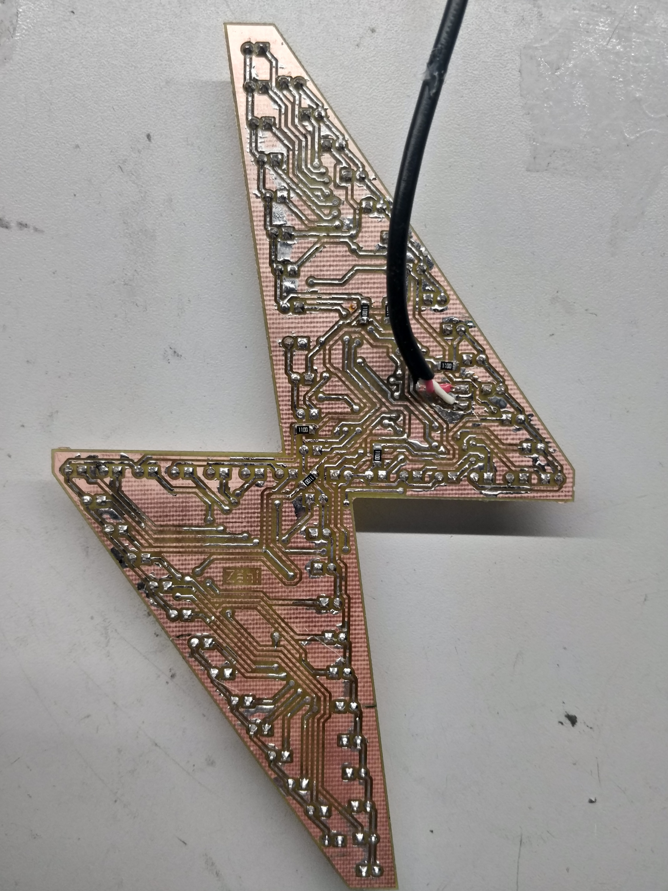

<!-- vim: ft=markdown nospell
-->
<i>

# Vanha kunnon possu... <b>ISONA!</b>

| Protolevy mk2 | [Selkäsalama](https://github.com/Elektroniikkakerho/Archived-projects/tree/master/salama ) Remake WIP |
|:---|:---                |
|   | 

<!--  -->

## SKEMAT
### Salama-64

Vanha tuttu [possusalaman ](https://github.com/Elektroniikkakerho/Led-merkki/tree/master) skema, paitsi tässä tuplasti ledejä 8x8 multiplex setupilla.  
Fuse asetus ajaa RESET pinnin IO pinniksi, jonka jälkeen koodin uudelleen puskeminen ei enään onnistu.  


### Selkäsalama-64
Koska selkäsalama koostuu kahdesta eri piirilevystä, yllä olevaan skemaan on lisätty hyppykaapelit, jotka yhdistävät ledien multiplexauksen. mm. J13 --> J14.

Koska levy on niin täynnä traceja (tai meikä niin huono leiskoissa), varsinaista piikkirimaa ohjelmoinille en laittanut. Levyssä on 4 pientä testi pädiä (lähellä piiriä), joihin juotetaan ohjelmointi kaapelit (RESET, SCK, MOSI JA MISO). Sama homma GND ja 5V. Ohjelmoinnin aikana, voit käyttää kondensaattorin pädejä.

Skemassa on cyaanin värisiä viivoja, jotka tarkoittavan piirin olevan alemmassa piirilevyssä.


## Protolevy mk2
| Etupuoli <sub>tirsk</sub> | Takapuoli <sub>tirsk</sub> |
|:---|:---                |
|   |  


## OSALUETTELO
| KPL | MITÄ               | HUOM    |
|:---:|:---                |:---    |
|  1  | ATtiny 861A SOIC   |       **U** malli ainakin toimii  |
|  64 | 5mm DIP LED        | Mallikappaleessa XL-502UBC ledit  |
|  8  | 110Ohm 1206        |    < 40ma per IO pin    |
|  1  | 10uF tant. SMD     |    Virtalähteen virran tasoitusta varten (optional)    |


| Muuta?  |
|:---|
| Joku kaapeli virransyöttä varten |
| Virtalähde 5V DC |
| Fläshäykseen Arduino ja 6 pinninen rima |
| 2 puolinen piirilevy, mallikappele on jyrsitty |
| Läpivientiniittejä, esim. 0.4mm niitit 0.8mm porauksille ja 0.8mm 1.2mm...  |
| 15 kpl hyppykaapeleita (selkäsalamaan) |

## Koodi
```bash
# Siirry koodi kansioon
cd src/

# Koodin kääntäminen
avr-gcc -mmcu=attiny861 main.c -I./ -Os -DF_CPU=8000000UL

# Fuse asetukset testaukseen  (huom. 8 lediä ei toimi)
avrdude -c avrips -p t861 -P /dev/ttyUSB0 -b 19200 -U lfuse:w:0xe2:m -U hfuse:w:0xdf:m

# Lopulliset fuse asetukset  (Reset pin --> IO pin) 
# Kaikki ledit toimii, mutta tämän jälkeen et pysty puskea uutta koodia!!! 
avrdude -c avrips -p t861 -P /dev/ttyUSB0 -b 19200 -U lfuse:w:0xe2:m -U hfuse:w:0x5f:m
```


## Fuse asetuksien nollaaminen
Tyliin joku 12V high voltage fuse resetter setuppi tai laita vaan uusi pirii tilalle :D
