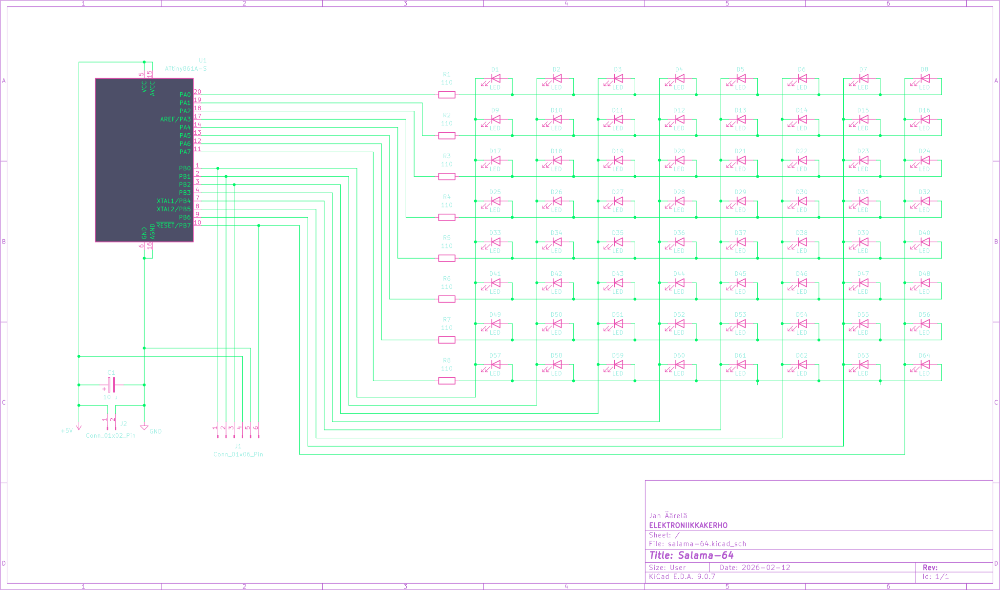
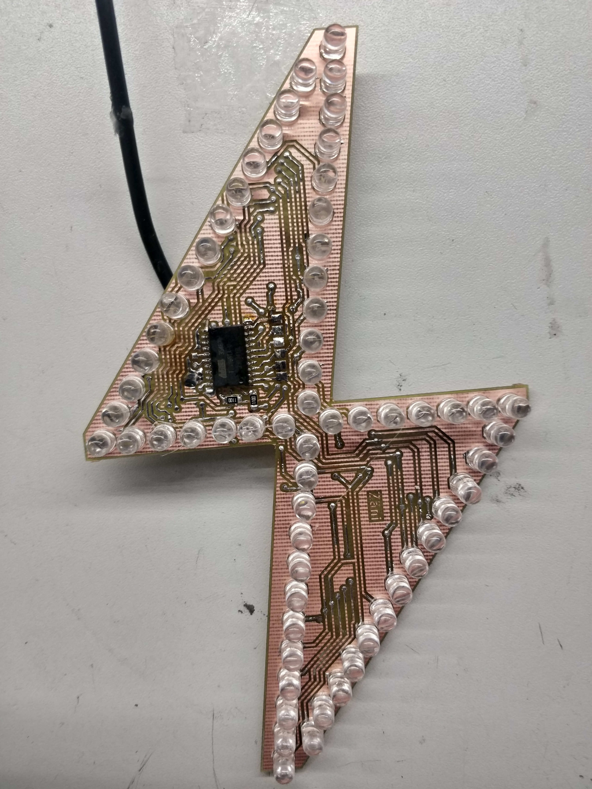

<i>

# Vanha kunnon possu... <b>ISONA!</b>


## SKEMA
Vanha tuttu possusalaman skema, paitsi tässä tuplasti ledejä 8x8 multiplex setupilla.  
Fuse asetus ajaa RESET pinnin IO pinniksi, jonka jälkeen koodin uudelleen puskeminen ei enään onnistu.  



## Protolevy mk2
| Etupuoli <sub>tirsk</sub> | Takapuoli <sub>tirsk</sub> |
|:---|:---                |
|   |  


## OSALUETTELO
|KPL | MITÄ               | Huomiot    |
|:---:|:---                |:---     |
| 1  | Attiny 861A SOIC   |       **U** malli ainakin toimii  |
| 64 | 5mm DIP LED         | Mallikappaleessa XL-502UBC ledit  |
| 8  | 110Ohm 1206        |    MAX 40ma per IO pin    |
| 1  | 10uF TANT. SMD           |    Virtalähteen virran tasoitusta varten (optional)    |

| Muuta?  |
|:---|
| Joku johto virransyöttä varten |
| Virtalähde 5V DC |
| Fläshäykseen Arduino ja 6 pinninen rima |
| 2 puolinen piirilevy, mallikappele on jyrsitty |
| Läpivientiniittejä, esim. 0.4mm niitit 0.8mm porauksille ja 0.8mm 1.2mm...  |

## Koodi
```bash
# Siirry koodi kansioon
cd src/

# Koodin kääntäminen
avr-gcc -mmcu=attiny861 main.c -I./ -Os -DF_CPU=8000000UL

# Fuse asetukset testaukseen  (huom. 8 lediä ei toimi)
avrdude -c avrips -p t861 -P /dev/ttyUSB0 -b 19200 -U lfuse:w:0xe2:m -U hfuse:w:0xdf:m

# Lopulliset fuse asetukset  (Reset pin --> IO pin) 
# Kaikki ledit toimii, mutta tämän jälkeen et pysty puskea uutta koodia!!! 
avrdude -c avrips -p t861 -P /dev/ttyUSB0 -b 19200 -U lfuse:w:0xe2:m -U hfuse:w:0x5f:m
```


## Fuse asetuksien nollaaminen
Tyliin joku 12V high voltage fuse resetter setuppi tai laita vaan uusi pirii tilalle :D
