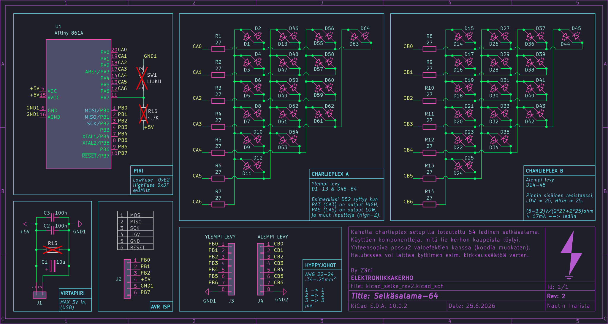

<!-- vim: ft=markdown nospell
-->
<i>


# Selkäsalama-64
Möykkäwaunujen proto salaman teon aikana huomasin, että salaman koko oli pikkasen pienempi mitä kuvittelin. Täysin toimiva siitähän tuli ja varsin hieno vaikka nopeasti tekasin sen.

Kaytin protoversiota yövalona kotona :D ja iski idea. Mitä jos, tästä tekisi selkäsalaman.  
[Niinkuin ysärillä...](https://github.com/Elektroniikkakerho/Archived-projects/tree/master/salama)  KiCadi tulille vaan ja lopputulos alla:

## Kuvia härpäkkeestä
|Homma in action|Etupuoli|Takapuoli| Takapuoli Kuorilla|
|---|---|---|---|
| | |  | 

## Skema
Homma toimii siten, että virtapankista tulee 5V ja menee suoraan piiriin. Konkka tasoittaa virran ja vastus toimii kuormana, mikäli virtapankki sammuu liian vähäistä virrankulutuksesta. Toinen ja energia tehokkaampi vaihtoehto on käyttää virtapankki kikkaa, eli ajoittain piikittää virran kulutusta ohjaamalla transistorin avulla vastusta.

Ledit on jaettu puolin kahteen eri charlieplexiin. (7^2-7 (-10) viritelmällä).  
Miksei kaikkia ledejä yhteen pleksiin? No siksi koska jos yhteen pleksiin laittaa kaikki ledit niin duty cycle olisi ~1.5%, joka on aika pieni. Kahdella pleksillä sen saa ~3%, jolloin ledit ovat kirkkaampia.

Napin tai liukukytkimen voi halutessa laittaa SW1 kohtaan johdoilla ja laittaa itse napin/liukukytkimen haalareihin, esim. kaulapantaan tai mikälie sen oikea nimi onkaan.





## Osaluettelo
| KPL | MITÄ               | HUOM    | 
|:---:|:---                |:---    |
|  1  | ATtiny 861A SOIC   |       Vähintään: Flash 4KB -  SRAM 256B   |
|  64 | 5mm DIP LED        | Tekijällä XL-502UBC ledit  |
|  14  | 27 Ohm 1206        |    < 20ma per IO pin    |
|  1  | 10 uF tant. 2312 SMD     |    Virtalähteen virran tasoitusta varten |
|  8  | Johdon pätkiä    |    Levyjen yhdistämiseen AWG 22-24 |
| 1 | Virtakaapelipari | Esim. USB |
| 1 | 6 pinninen rima | THT vaaka versio |


| Muuta?  |
|:---|
| Fläshäykseen Arduino ja 6 pinninen rima |
| PETG Filamettia kuorien tulostamiseen|
| (Optinal) Lisävastus mikäli salama sammuu|
| (Optinal) 2kpl 1206 100 nF keraamisia konkkia  |
| (Optinal) Nappi/Liukukytkin halutessa ja siihen johdot|


## Piirilevyt

Mikäli kerholla ei ole levyjä tähän projektiin, voit yrittää tehdä levyn esimerkiksi jyrsimällä tai etsaamalla. Tracien paksuudet ovat 0.4mm kestävyyden/tuotannon tolaranssin takia. Projektiin käy esimerkiksi 2-puoleinen 1oz 1.6mm PCB. Jos teet paksummasta levystä piirilevyt, joudut muokkaamaan kuorien mitat, jotta levyt mahtuvat niihin. 

Läpivientien kanssa joutuu painimaan sillä jyrsimisen/perus etsauksen jälkeen ne ei ilmesty itsestään vaan ne joutuu manuaalisesti tehdä ne. Yks tapa on käyttää läpivientiniittejä ja pressiä. Pressin jälkeen kannattaa ehdottamasti juottaa niitit traceihin, että varmasti toimivat. Jos niitit eivät mahdu reikiin, täytyy vaihtaa vioiden ja ledien reikien koot kicadillä. Tarkista, että niittien läpi mahtuu komponentit. Voi olla, että reikiä pitää kasvattaa...


## LEDIT
Tähän kannatta käyttää hyvin kirkkaita ledejä esim.  10000 mcd tai kirkkaammat,   
koska yhden ledin duty cycle on sen 1/32 ajasta eli ~ 3%.

Testaa ledin kirkkaus virtalähteellä.
Asetukset: square, 2.5V offset, 2.5V amplitude ja 3% duty cycle.

**Jos ledejä ei ole diffusoitu, niin ehdottamasti diffusoi ne.**  
Muuten selkäsalamasta tulee saatananmoinen valokeila ja sivusta katsottuna näyttää himmeältä.  

Hidas, mutta puhtaamman jäljen saat kun hiot jokaisen ledin 400-600 grid vesihiomapaperilla.

Toinen ja huomattavasti nopeampi tapa on käyttää hiekkapuhallinta. 
Eli laita kaikki ledit reikälevyyn ja teippaa ledien jalat.
Samaan tyliin kuin konkat tulee rullana. Ja ei muutakun hiekkapuhaltimella ammuskelemaan.
Voit puhdistaa ledit hiekasta laittamalla ledit astiaan jossa on nestettä (vesi/ipa) ja astian ultraäänipuhdistimeen.


## Kasausohjeet
Projekti aika pitkälti noudattaa possusalaman ohjeita.

 1. Juota siis piiri, konkka, 14 vastusta ja piikkirima.  
    Piikkirimasta trimmataan 4 sisimmäistä jalkaa, että se asettuisi lättänä.

2. Seuraavaksi laitetaan piirilevyt kiinni haalareihin.  
    Katko ledien jalat teräviksi ja yritä kohdistaa levy paikalleen.  
    Tässä kannattaa laittaa ledit niin, että haalarin salaman ääriviivat kulkee ledien keskellä.  
    Ledit mahdollisman hyvin kiinni piirilevyä vasten, näyttää suoremmalta.  
    Ja kannattaa jättää pieni rako piirilevyjen välille,  ettei hankaudu.  
    Tee sama toiselle piirilevylle. 

3. Sitten voit juottaa hyppyjohdot levylle, jossa on piiri.  
    Kannattaa juottaa hyvin ja niin että johdon muovi on mahdollisimman lähellä levyä.  
    Katko juottamisen jälkeen etupuolelta töpröttävät johdot pätkät.

4. Sittenkun kummatkin levyt ovat haalareissa kiinni, yhdistä levyt hyppykaapelilla.  
    Kaapelit menee järjestyksessä. Kanattaa olla vähän löysää, että koko härpäke pystyy taittumaan.
   

5. Kiinnitä Ardu piikkirimaan kiinni ja siirrä koodi levylle käyttäen AVR-ISP.  
    Ohjeet alempana.

6.  Jos kaikki toimii, juota seuraavaksi virtakaapeli ja tarvittaessa kuormavastus mikäli virtapankki lopettaa virranannon (virtasyöppö esto). Esim. 110 Ohm tai 169 Ohm...

7. Kuoret saa tulostettua FabLabilla ja mielellään kannattaa käyttää PETG. Tämä taipuu hyvin eikä halkea yhtä herkästi verrattuna esim. ABS muoviin. Tulostuksen jälkeen pitää putsata kuorien klipsien/kielien supportit pois. Esim varovasti veitsellä. Voit testata, että mahtuuko levy siihen, jos laitat 1.6mm levyn pätkän klipsin ja reunan (jossa piirilevyt istuu) väliin.

    Jos olet tehnyt piirilevyt paksummasta levystä, pitää muokata kuorien mittoja joko muokkaamalla STL tai blender projekti tiedostoa. 

8. Kuoret sopivat kummallekin piirilevylle.  
    Kolvilla voit tehdä master levyn kuoren reunalle reiän virtakaapelille.

    Kannattaa laittaa kuoret kiinni siten, että laitat ensin terävän kulman ensin kiinni ja siitä sitten siirry ylöspäin. Venytä kuorta ulospäin paina kiinni.

    Juuh, eikait siinä. Nyt **JÖÖTI** "possu" selässä  👌


## Koodi

```bash
# Siirry koodi kansioon
cd src/

# Koodin kääntäminen
avr-gcc -mmcu=attiny861 main.c kuviot.c vilkutus_charlie.c -I./ -Os -ffunction-sections -fdata-sections -Wl,--gc-sections -DF_CPU=8000000U

# Fuse asetukset
avrdude -c avrisp -p t861 -P /dev/ttyUSB0 -b 19200 -U lfuse:w:0xe2:m -U hfuse:w:0xdf:m

# Koodin siirto levylle
avrdude -c avrisp -p t861 -P /dev/ttyUSB0 -b 19200 -U flash:w:a.out

# Testaukseen voit käyttää yhtä komento riviä yhdistämällä koodin käännös ja siirto komennot (bash:)
avr-gcc -mmcu=attiny861 main.c kuviot.c vilkutus_charlie.c -I./ -Os -ffunction-sections -fdata-sections -Wl,--gc-sections -DF_CPU=8000000U && sudo avrdude -c avrisp -p t861 -P /dev/ttyUSB0 -b 19200 -U flash:w:a.out
```


