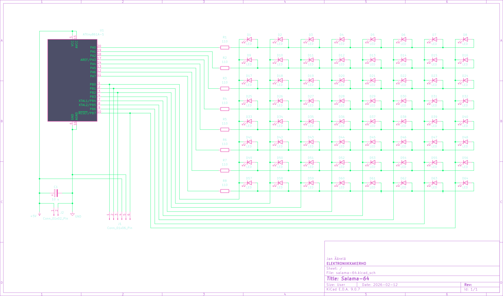
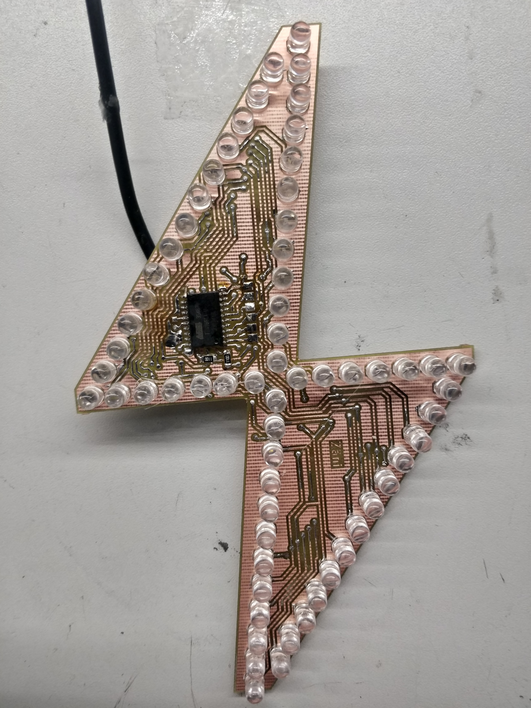
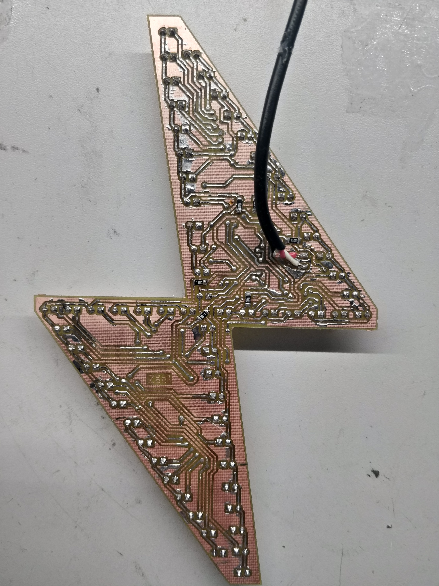
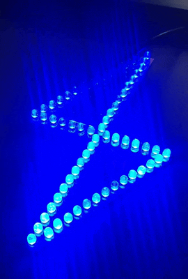

<!-- vim: ft=markdown nospell
-->
<i>

# Salama-64

Vanha tuttu [possusalaman ](https://github.com/Elektroniikkakerho/Led-merkki/tree/master) skema, paitsi tässä tuplasti ledejä 8x8 multiplex setupilla.  
Fuse asetus ajaa RESET pinnin IO pinniksi, jonka jälkeen koodin uudelleen puskeminen ei enään onnistu.  

## Protolevy mk2
| Etupuoli tirsk | Takapuoli tirsk |
|:---|:---                |
|   |  

## Demo

