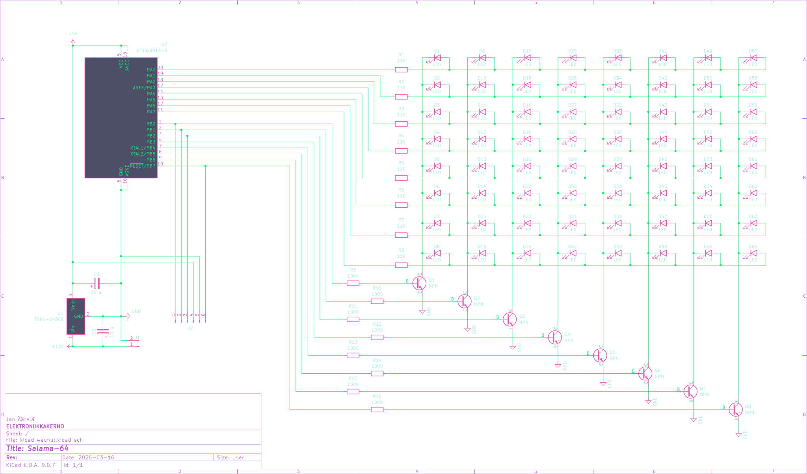

<!-- vim: ft=markdown nospell
-->
<i>

# Waunujen salama
Koko git repon alkuperäinen tarkoitus oli tehdä möykkäwaunuihin **MEGA** salama waunujen keulaan.
Mutta pitihän siinä välissä tehdä selkasalama sidequest ja nyt palataan alkuperäiseen projektiin.

## Skema
Sama mitä proto versiossa, mutta lisätty NPN transistorit jokaisen multipleksaus sarakkeen jälkeen.  
Proto versiossa ilmeni, että kun vilkutat yhtä lediä 64-ledi multiplex setupissa, kirkkaus tippuu rajusti. Selkäsalamaan lisäsin hedari tiedoston joka vilkuttaa kahta lediä kerralla. Just riittää attinyn IO virta speksin mukaan. (40mA MAX per IO pin, eli 2x~17mA = 34mA). 

Tässä versiossa 8 lediä vilkuttaa kerralla, joten se ylittää sen 40mA ( ~160mA) ja lopputulos olisi "magick smoke"... Eli pelkkä koodin muutos tähän hommaan ei riitä.

Nyt multipleksauksen "blocking" sarakeet ovat attinyn IO ohjaamia transistorin kautta, joka sitten ulostaa loput virrat maahan.

