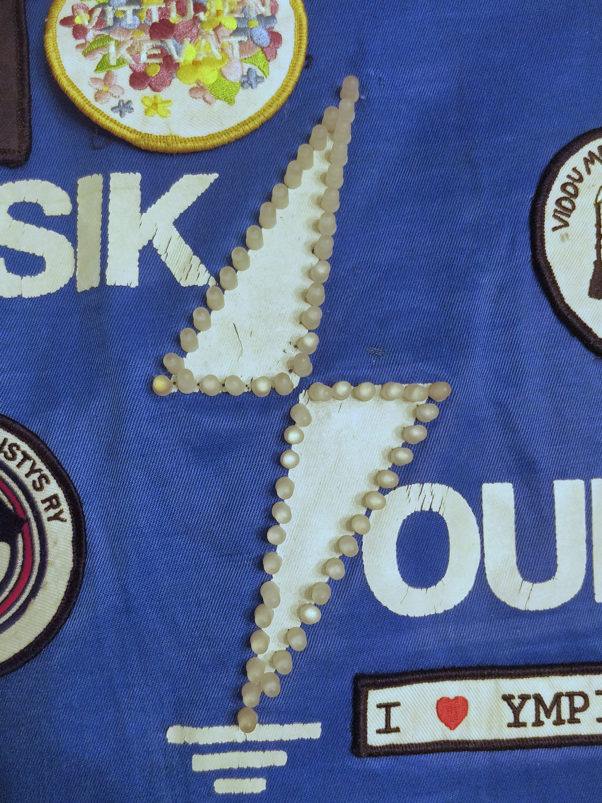
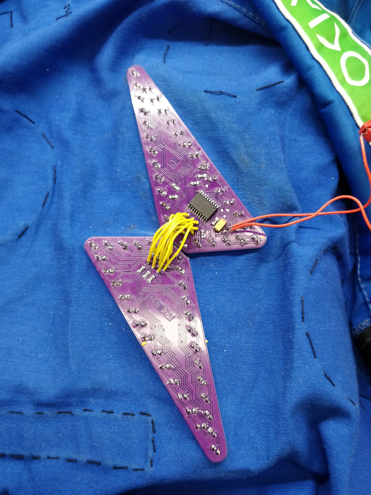
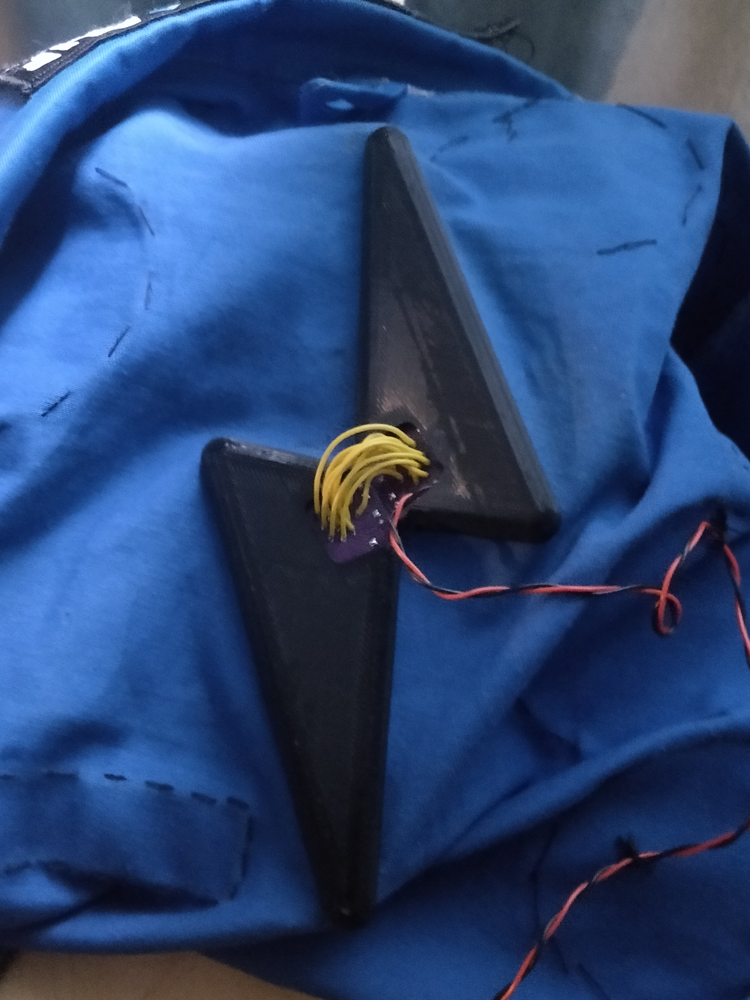
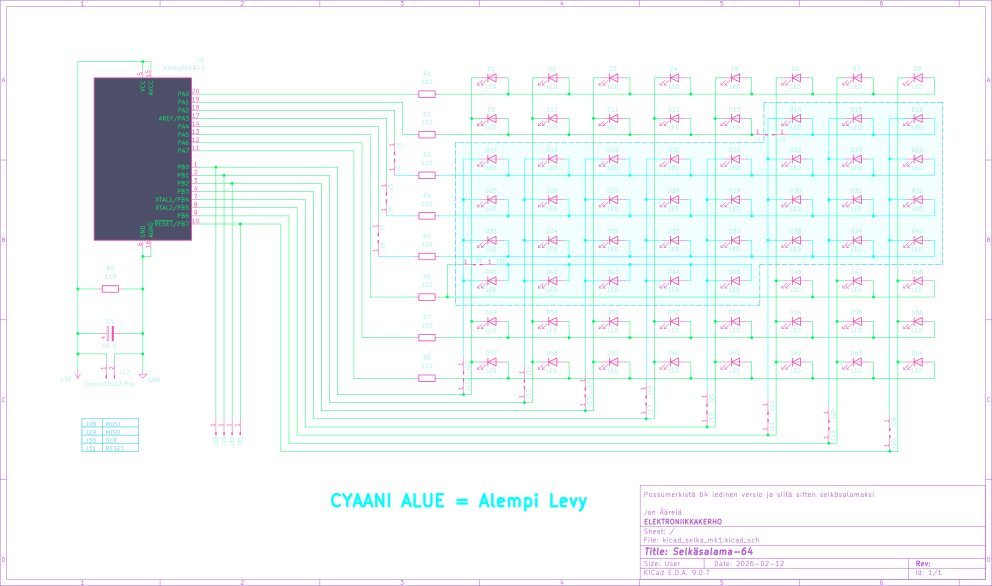
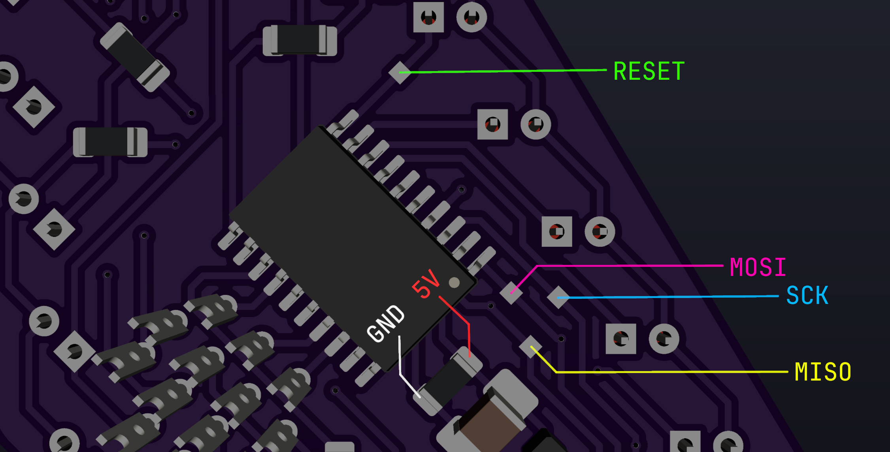

<!-- vim: ft=markdown nospell
-->
<i>


# Selkäsalama-64
Möykkäwaunujen proto salaman teon aikana huomasin, että salaman koko oli pikkasen pienempi mitä kuvittelin. Täysin toimiva siitähän tuli ja varsin hieno vaikka nopeasti tekasin sen.

Ihailin sitä tunteja ja mieleeni tuli yhtäkkiä idea. Mitä jos, tästä tekisi selkäsalaman. [Niinkuin ysärillä...](https://github.com/Elektroniikkakerho/Archived-projects/tree/master/salama)  
KiCadi tulille vaan ja lopputulos alla:

## Kuvia härpäkkeestä
|Demo|Etupuoli|Takapuoli Kuoriton| Takapuoli Kuorilla|
|---|---|---|---|
| | |  | 

## Skema
Koska selkäsalama koostuu kahdesta eri piirilevystä, skemaan on lisätty hyppykaapelit, jotka yhdistävät ledien multiplexauksen. esim. J13 --> J14.

Koska levy on niin täynnä traceja, enkä jaksunut vaivata, varsinaista piikkirimaa ohjelmoinille en laittanut. Levyssä on 4 pientä testi pädiä (lähellä piiriä), joihin juotetaan ohjelmointi kaapelit (RESET, SCK, MOSI JA MISO). Ohjelmoinnin aikana, voit käyttää kuormavastuksen pädejä (GND ja 5V).

Skemassa on cyaanin värisiä viivoja, jotka tarkoittavan piirin olevan alemmassa piirilevyssä.




## Osaluettelo
| KPL | MITÄ               | HUOM    | 
|:---:|:---                |:---    |
|  1  | ATtiny 861A SOIC   |       **U/SU** malli ainakin toimii  |
|  64 | 5mm DIP LED        | Tekijällä XL-502UBC ledit  |
|  8  | 110Ohm 1206        |    < 20ma per IO pin    |
|  1  | 10uF tant. SMD     |    Virtalähteen virran tasoitusta varten |


| Muuta?  |
|:---|
| Joku kaapeli virransyöttä varten |
| Fläshäykseen Arduino ja 6 pinninen rima |
| Johdon pätkiä levyjen yhdistämiseen |
| PETG Filamettia kuorien tulostamiseen|
| Lisävastus mikäli salama sammuu|

## Piirilevyt
Mikäli kerholla ei ole levyjä tähän projektiin, voit yrittää tehdä levyn esimerkiksi jyrsimällä tai etsaamalla. Tracien paksuudet ovat 0.4mm kestävyyden/tuotannon tolaranssin takia. Projektiin käy esimerkiksi 2-puoleinen 1oz 1.6mm PCB. Jos teet paksummasta levystä piirilevyt, joudut muokkaamaan kuorien mitat, jotta levyt mahtuvat niihin. 


Läpivientien kanssa joutuu painimaan sillä jyrsimisen/etsauksen jälkeen ne ei ilmesty itsestään vaan ne joutuu manuaalisesti tehdä ne. Yks tapa on käyttää läpivientiniittejä ja pressiä. Pressin jälkeen kannattaa ehdottamasti juottaa niitit traceihin, että varmasti toimivat. Jos niitit eivät mahdu reikiin, täytyy vaihtaa vioiden ja ledien reikien koot kicadillä. 


## LEDIT
Tähän kannatta käyttää hyvin kirkkaita ledejä ~ 10000 mcd, sillä yhden ledin duty cycle on sen 1/64 ajasta eli ~ 1.5%. Tai tuplasti riippuen mitä koodin hedari tiedostoa käytät.

Testaa diffusoitu ledi virtalähteellä.  
Asetukset: square, 1.6V offset, 3.2V amplitude ja 1.5% tai 3% duty cycle.

Jos omasta mielestä sopivan kirkkaat ledit, ei muutakun kasamaan...

## Kasausohjeet
Projekti aika pitkälti noudattaa possusalaman ohjeita.

 1. Juota siis piiri, konkka ja 8 vastusta. Jätä konkan vierestä vastus juottamatta.  
    Se on kuormavastukselle varattu paikka ja käytetään myös ohjelmoinnissa.

2. Sitten voit juottaa hyppyjohdot levylle, jossa on piiri.  
    Kannattaa juottaa hyvin ja niin että johdon muovi on mahdollisimman lähellä levyä.  
    Katko juottamisen jälkeen etupuolelta töpröttävät johdot pätkät.

3. Seuraavaksi laitetaan piirilevyt kiinni haalareihin.  
    Katko ledien jalat teräviksi ja yritä kohdistaa levy paikalleen.  
    Tässä kannattaa laittaa ledit niin, että haalarin salaman ääriviivat kulkee ledien keskellä.  
    Suosittelen laittamaan ledit mahdollisman hyvin kiinni piirilevyä vasten, näyttää suoremmalta.  
    Ja kannattaa jättää pieni rako piirilevyjen välille,  ettei hankaudu.  
    Tee sama toiselle piirilevylle. 

    **Jos ledejä ei ole diffusoitu, niin ehdottamasti diffusoi ne.**  
    Muuten selkäsalamasta tulee saatananmoinen valokeila ja sivusta katsottuna näyttää himmeältä.  

    Hidas, mutta puhtaamman jäljen saat kun hiot jokaisen ledin 400-600 grid vesihiomapaperilla.  
    Toinen ja huomattavasti nopeampi tapa on käyttää hiekkapuhallinta. 
    Eli laita kaikki ledit reikälevyyn ja teippaa ledien jalat.
    Samaan tyliin kuin vastukset tulee rullana. Ja ei muutakun hiekkapuhaltimella ammuskelemaan.

4. Sittenkun kummatkin levyt ovat haalareissa kiinni, yhdistä levyt hyppykaapelilla.  
    Katso leiskasta, mikä kaapeli menee mihinkin, mutta kannattaa aloittaa yhtistäminen ylhäältä alas, vasemmalta oikealle, järjestyksessa. Tuplachekkaa leiskasta/skemasta, että kaikki menee oikein. Kaapeleiden ei kannata olla kovin pitkiä eikä lyhyitä.


5. Tee arduun yhteys. Tässä kuva missä ovat selkäsalaman ohjelmointi pädit:
    

6. **Seuraavaksi siirrä koodi levylle ja palaa tähän takaisin.**

7.  Jos kaikki toimii, juota seuraavaksi virtakaapeli ja tarvittaessa kuormavastus mikäli virtapankki lopettaa virranannon (virtasyöppö esto). Esim. 110Ohm tai 169Ohm...

8. Kuoret saa tulostettua FabLabilla ja mielellään kannattaa käyttää PETG. Tämä taipuu hyvin eikä halkea yhtä herkästi verrattuna esim. ABS muoviin. Tulostuksen jälkeen pitää putsata kuorien klipsien/kielien supportit pois. Esim varovasti veitsellä. Voit testata, että mahtuuko levy siihen, jos laitat 1.6mm 1oz/2oz levyn pätkän klipsin ja reunan (jossa piirilevyt istuu) väliin.

    Jos olet tehnyt piirilevyt paksummasta levystä, täytyy sinun muokata kuorien mittoja joko muokkaamalla STL tai blender projekti tiedostoa. 

9. Kuoret sopivat kummallekin piirilevylle.  
Kannattaa laittaa kuoret kiinni siten, että laitat ensin terävän kulman ensin kiinni ja siitä sitten siirry ylöspäin. Venytä kuorta ulospäin paina kiinni.

Juuh, eikait siinä. Nyt loistaa **MEGA**possu selässä  👌


## Koodi


```bash
# Siirry koodi kansioon
cd src/

# Koodin kääntäminen
avr-gcc -mmcu=attiny861 main.c -I./ -Os -ffunction-sections -fdata-sections -Wl,--gc-sections -DF_CPU=8000000U

# Fuse asetukset mm. efektien testaukseen... (huom. 8 lediä ei toimi)
avrdude -c avrisp -p t861 -P /dev/ttyUSB0 -b 19200 -U lfuse:w:0xe2:m -U hfuse:w:0xdf:m

# Koodin siirto levylle
avrdude -c avrisp -p t861 -P /dev/ttyUSB0 -b 19200 -U flash:w:a.out

# kuviot.c tiedossa on hedari tiedostot vilkutus.c ja vilkutus_2x.c.
# Voit kokeilla vaihtaa tiedostoa.
# 2x tiedosto vilkuttaa kahta lediä samaan aikaan, eli se on kirkkaampi. 2x duty cycle.
# Mutta atm buginen, joka kahdeksas ledi himmenee/kirkastuu riippiuen kuvioefektistä.
# Voit myös muokata / tehdä omia kuvioefektejä muokkaamalla main.c ja kuviot.c

# Testaukseen voit käyttää yhtä komento riviä yhdistämällä koodin käännös ja siirto komennot.
# (bash shell)
avr-gcc -mmcu=attiny861 main.c -I./ -Os -ffunction-sections -fdata-sections -Wl,--gc-sections -DF_CPU=8000000U && sudo avrdude -c avrisp -p t861 -P /dev/ttyUSB0 -b 19200 -U flash:w:a.out

# Lopulliset fuse asetukset  (Reset pin --> IO pin) 
# Kaikki ledit toimii, mutta tämän jälkeen et pysty puskea uutta koodia!!! 
avrdude -c avrisp -p t861 -P /dev/ttyUSB0 -b 19200 -U lfuse:w:0xe2:m -U hfuse:w:0x5f:m
```


## Fuse asetuksien nollaaminen
Tyliin joku 12V high voltage fuse resetter setuppi tai laita vaan uusi pirii tilalle :D


